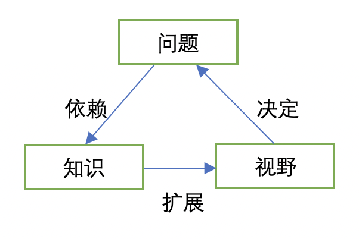

# 我在47岁生日前才有所领悟

## 综述

* 我不知道其他人是怎么对待难题的，我以往的个人经验是，找些相关的书籍看看有没有答案，或者看着别人正在做我去模仿，我会按照看起来合理的步骤去实践，通过反馈来决定是否找对了正确答案。大多数情况下，如果运气好就会做得不错，反之可能做着做着就放弃了。
* 我昨晚先是看了一个YouTube视频讲了一个普通人如何创建一人企业，然后看了《认知红利》中讲解问题和知识的关系，我忽然就有所领悟，明白了过去在解决难题上，为什么会失败，比如：为什么一直赚不到钱。

## 难题为什么是难题

### 1. 可能问错了问题

### 2. 可能缺少专业知识（方法论）

## 我的领悟

1. 我在中学时期看卡耐基的书，印象最深刻的一句话就是：把问题写下来就解决了一半。这对于青春期心理问题很多的我的确有效，因为当时很大的困扰来自于大脑里的自我对话，写到纸上之后就会发现很多问题都不值一哂。
2. 然而难题不是这样，20多年的程序员生涯中，我辞职试图自己创业多次，每次的结果都是去上班赚生活费。我也试图抓住投资机会多次，每次都是被割韭菜，无论是P2P、A股还是泰国买房，结果都是赔掉辛苦打工的工资。我还试过网赚，当有上家介绍机会时，我发现的确是无本买卖，然而做了没几周被告知平台政策发生变化，没法继续，我才知道流传出来的网赚都是别人用过的渣渣。
3. 难题最大的难点在于需要更长的时间去解决。比如：当你发现某种趋势或者business的时候，自己缺少对应的能力形成优势，那么就需要通过学习去提高自己。这种长期的目标很容易让人放弃，甚至暮然回首发现自己停留在多年前的状态，面对着多年前就已经发现的难题，没有任何进展。就好像，明明需要花费时间去看书看教程的时候，总告诉自己今天放松一下，明天再开始。“知人者智，自知者明”，看别人很容易找出一堆问题和缺点，看自己哪哪儿都好。
4. 回顾我的几次创业，基本上都是跟着感觉走。毕业后第二年，接触了互联网泡沫破灭的最后一波，就试图凭借短短的一年从业经验去做“CIO/CTO”的技术转型咨询——我还是通过QQ找到一个潜在客户。之前聊了很久，到了要付钱的时候，对方没有回复了，我才发现对方大概只是想找个人聊天而已。后来还试过在瓷杯上打印照片卖，设备买了之后没有任何靠谱的推广方案——这次完全是看到别人的宣传可以赚钱。
5. 当我试图靠着一个开源CRM产品做本地化推广时，我发现虽然市场有，也能找到客户，但是这个海外产品水土不服，还需要大量的时间去改造，最终还是放弃了。唯一的收获是，靠着这个资历在一家大的在线旅游公司得到一份17500月薪的工资，那是2006年，这个薪资水平已经很不错了。